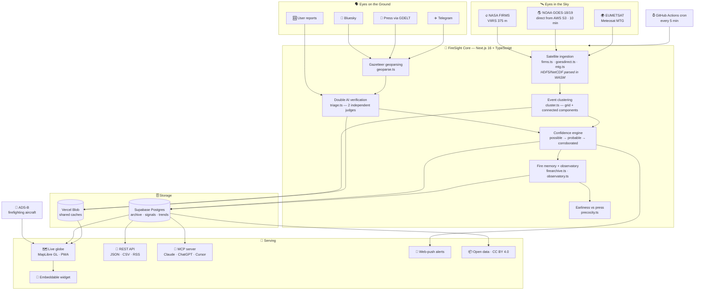
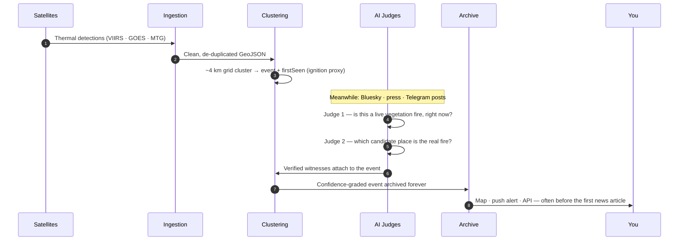

# 🔥 FireSight — Every spark in sight.

**Early wildfire detection, worldwide, free — often before the media.**

🌍 *Submitted to* ***NextStep Hacks 2026*** *— theme:* ***Earth Forward*** 🌱

---

## 🐤 Inspiration

The canary once sang in the coal mine — a tiny signal that saved lives because it came **early**.

Wildfires today move faster than the information about them. Again and again, the same pattern repeats:

| 😟 The painful reality | 💥 What it costs |
| --- | --- |
| 🕐 Official alerts often arrive **hours after ignition** | Families lose the "golden hour" to evacuate |
| 📰 Most people learn about fires **from the news** | The story breaks *after* the fire is out of control |
| 🛰️ Satellites see everything — but the data is **raw, scattered, expert-only** | A life-saving signal sits unread in a NetCDF file |
| 🗣️ Eyewitnesses post **within minutes** on social media | Their warnings drown in noise, unverified and unmapped |
| 💸 Good fire dashboards are **paywalled or regional** | Most of the planet has no free, live picture at all |

We asked a simple question: **what if the planet had a canary?** A system that never sleeps, watches every satellite pass, listens to every verified witness, and taps you on the shoulder the moment a spark appears — in your language, for free.

That question became **FireSight**.

---

## 🔥 What it does

FireSight is a **free, independent, near-real-time world map of wildfire ignitions**. One glance tells you what is burning, where, how sure we are, and who is fighting it.

| 🧩 Capability | ✅ What you get |
| --- | --- |
| 🌐 **Live fire globe & map** | Every active ignition on Earth on an interactive 3D globe (MapLibre GL), with **6 h / 24 h / 72 h** time windows, a smoke layer, city search and "My location" |
| 🛰️ **Multi-satellite fusion** | **NASA FIRMS (VIIRS 375 m)** + **NOAA GOES-18/19** (read *directly from public AWS buckets*, ~10-minute refresh — about 30 minutes earlier than FIRMS) + **EUMETSAT Meteosat MTG**, merged and de-duplicated |
| 🤖 **Double AI verification** | Citizen reports from **Bluesky, press (GDELT) and Telegram** are geoparsed, then judged **twice by independent AI models** — "is this a fire *right now*?" and "*which* place is the fire?" — before they ever touch the map |
| 🚦 **Honest confidence levels** | Every fire climbs `possible` → `probable` → `corroborated` as evidence stacks up. No crying wolf |
| ✈️ **Water-bomber tracking** | Firefighting aircraft identified **live from ADS-B** (registration + ICAO type) — watch the response unfold |
| 🔔 **Free area alerts** | "Alert me on this area" — one tap, **web-push notifications**, no account, checked every 5 minutes |
| 📖 **Fire memory** | Every significant fire gets a **permanent, citable archive page** — a memory the internet keeps |
| 📊 **Observatory** | Citable wildfire statistics **per country and per month**, for journalists, researchers and policymakers |
| ⏱️ **Measured earliness** | We compare our first detection against first press coverage — and **publish our lead time** |
| 🌍 **For everyone** | Fully translated in **French, English, Spanish and Portuguese**, installable as a PWA, embeddable as a free widget |
| 🤝 **Agent-native** | A public **MCP server** lets Claude, ChatGPT, Cursor or any AI agent query live fire data as first-class tools |

> ⚠️ FireSight is an **information service, not an official alert channel**. In an emergency, call **112** (Europe), **911** (North America), **193** (Brazil) or your local emergency number.

---

## 📸 See it in action

*🌍 The live 3D globe — every active ignition on Earth. 15 firefighting aircraft airborne. 116 active fires in Russia at capture time.*

  

*🕐 The 24-hour window over the Americas — 254 active fires in Brazil, tracked in real time.*

  

*🔎 Zoomed into South America — clustered fire events, live per-country counters, one-tap area alerts.*

---

## 🛠️ How we built it

FireSight is a **detection pipeline**, not a dashboard. Raw space hardware telemetry goes in one end; a trusted, human-readable fire alert comes out the other.

### 🧬 The journey of one spark

### 🧰 The stack

| Layer | Technology | Why it's cool 😎 |
| --- | --- | --- |
| 🖥️ **Framework** | Next.js 16 (App Router) · React 19 · TypeScript 5 | Server components + route handlers run the entire public API |
| 🗺️ **Maps** | MapLibre GL 5 | GPU-accelerated globe projection with custom flame sprites |
| 🛰️ **Satellite parsing** | h5wasm · fflate | Raw **NetCDF4/HDF5 GOES fire products parsed in pure TypeScript/WASM** — no Python, no GDAL, no server-side binaries |
| 🤖 **AI** | OpenAI — two independent judging passes + custom gazetteer geoparsing | Consensus before any human report reaches the map; kills classic traps like "The Globe and Mail" → Globe, Arizona |
| 🗄️ **Data** | Supabase (Postgres) · Vercel Blob | Permanent fire memory + shared edge caches |
| 🤝 **Agent protocol** | Model Context Protocol (`mcp-handler`) | LLMs query live wildfire data as native tools |
| 🔔 **Notifications** | Web Push (VAPID) | Per-area subscriptions dispatched by a 5-minute cron |
| ⚙️ **Ops** | GitHub Actions (CI + cron) · Vercel | Zero-cost scheduler; **CI builds and validates everything with zero secrets** |
| ✅ **Quality** | Zod 4 · custom SEO guard · QA harness | Every external payload schema-checked; structural SEO contracts fail the build |

### 📈 By the numbers

| 📄 TS/TSX files | 🧮 Lines of code | 🛰️ Satellite sources | 🗣️ Witness channels | 🌐 Languages | ⏱️ Refresh | 💰 Price |
| :---: | :---: | :---: | :---: | :---: | :---: | :---: |
| **124** | **~23 900** | **3 agencies · 5+ instruments** | **3** | **4** | **~10 min** | **$0, forever** |

---

## 🧗 Challenges we ran into

| 🧩 Challenge | 🛠️ How we solved it |
| --- | --- |
| **FIRMS publishes GOES data ~40 min late** | We bypassed it: read the raw ABI L2 fire products **straight from NOAA's public AWS buckets** — available ~10 min after scan. That meant parsing binary **HDF5/NetCDF in TypeScript** via WebAssembly (h5wasm), including a nasty silent-NaN bug where scalar HDF5 attributes arrive as `TypedArray(1)` and poison every geolocation calculation |
| **Social media is a firehose of false alarms** | One AI pass wasn't enough. "The Globe and Mail" is a newspaper, not Globe, Arizona. So every candidate post is judged by **two independent AI models** — one for relevance ("is this a fire happening *now*?"), one for place disambiguation — with verdicts cached for 7 days to control cost |
| **Turning dots into fires** | Individual hotspots are noisy. We built a stateless **spatial-grid + connected-components (8-neighbour) clustering engine** that groups detections into events in one pass — the first detection becomes the ignition-time proxy |
| **Free tier, 5-minute cadence** | Serverless crons only run daily — so **GitHub Actions became our free 5-minute trigger**, with timeouts aligned to function limits so slow scans don't false-alarm |
| **Truthful UI under uncertainty** | Fires are scary; false alarms are worse. The whole UI speaks in **confidence levels**, not absolutes, with a permanent emergency disclaimer and measured self-evaluation (we publish our lead time over the press) |

---

## 🏆 Accomplishments that we're proud of

- ⏱️ **We beat the press — and prove it.** The *precocity* module measures how much earlier FireSight surfaces each fire versus first media coverage, and publishes the number.
- 🛰️ **GOES data ~30 minutes earlier than the standard feed** by reading space-agency hardware products directly — in the browser-era stack, with zero native dependencies.
- 🤖 **A double-AI jury for citizen reports** that actually works in production, with cached verdicts and QA re-judgement to catch regressions.
- 🤝 **One of the first wildfire datasets with an MCP server** — any AI agent on Earth can ask FireSight "what's burning near me?" in one tool call.
- 💪 **Zero-secret resilience**: every page degrades gracefully, and CI proves it on every push with a blocking SEO guard, type gate and production build.
- 🌍 **Free, open, multilingual** — 4 languages, CC BY 4.0 data, no accounts, no paywalls. The communities most at risk pay nothing.

---

## 📚 What we learned

- 🧊 **Deep satellite engineering**: VIIRS vs geostationary trade-offs, FRP (Fire Radiative Power), detection confidence codes, and the quirks of HDF5 attributes in WASM.
- 🤖 **AI in production is a systems problem**: prompt design matters less than caching, batching, budgets, and knowing when *not* to call the model (keyword-only fallback when no key is present).
- 🗺️ **Geospatial algorithms**: grid clustering, connected components, gazetteer matching, perimeter and risk layers (NIFC, DFCI).
- 🔔 **Web Push end-to-end**: VAPID, service workers, subscription storage, and cron-based dispatch.
- 🤝 **Model Context Protocol**: designing tools that LLM agents can use safely and usefully.
- 🧭 **Product honesty**: how to communicate uncertainty (`possible` → `probable` → `corroborated`) without either panic or false comfort.

---

## 🚀 What's next for FireSight

- [ ] 📡 **More eyes in the sky** — Sentinel-3 SLSTR and additional geostationary feeds
- [ ] 🌫️ **Smoke-drift forecasting** — where will the smoke be in 6 hours?
- [ ] 🏘️ **Community verification network** — partnering with local environmental organizations and fire services (as the hackathon theme encourages!)
- [ ] 📱 **Native mobile app** — the PWA is live; native push is next
- [ ] 🧾 **DOI for the open dataset** — making FireSight citable in academic research

---

## 🏅 Why FireSight — judging criteria at a glance

| 🥇 Criterion | 🔥 How FireSight answers |
| --- | --- |
| **Originality** | Not another dashboard — a full *detection pipeline*: direct-from-AWS satellite parsing, dual-AI-verified citizen signals, live firefighting aircraft, permanent fire memory, and a published lead-time metric |
| **Adherence to Track** | **Earth Forward, fully** 🌱: earlier detection = faster response = saved forests, saved biodiversity, avoided CO₂, saved lives — delivered free to the communities that need it most |
| **Completion** | Everything works: live globe, alerts, archive, observatory, REST/CSV/RSS API, MCP server, embeddable widget, PWA, 4 languages — enforced by CI on every push |
| **Learning** | HDF5-in-WASM, MCP, ADS-B decoding, geospatial clustering, web-push — all new ground, all in one build |
| **Design** | A real design system (`handoff/`) with brand tokens and a tone charter — calm, precise, never alarmist; clean mobile-first UI |
| **Technology** | 3 satellite constellations + 3 witness channels + 2 AI judges + ADS-B + push + MCP — many hard parts, one elegant pipeline 🤯 |

---

## 🔗 Links

- 💻 **Source code:** [github.com/theyapguard/FireSight](https://github.com/theyapguard/FireSight)
- 📦 **JS client:** [`packages/firesight-fires`](https://github.com/theyapguard/FireSight/tree/main/packages/firesight-fires)
- 🤖 **MCP manifest:** [`server.json`](https://github.com/theyapguard/FireSight/blob/main/server.json)

---

### 🌱 Earth Forward — because the planet can't wait for the news. 🔥

**Built with ❤️ for NextStep Hacks 2026**

⭐ *If FireSight sparked your interest, star the repo!* ⭐

