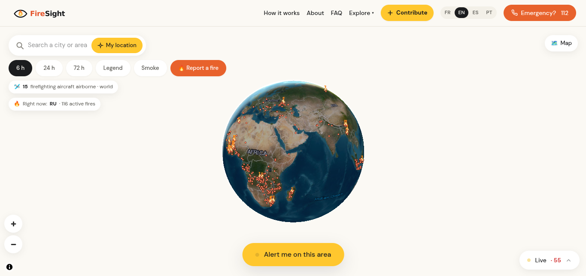
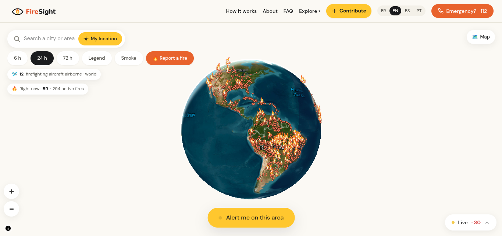
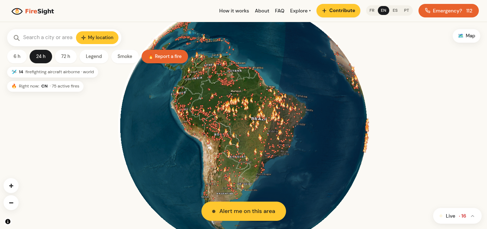
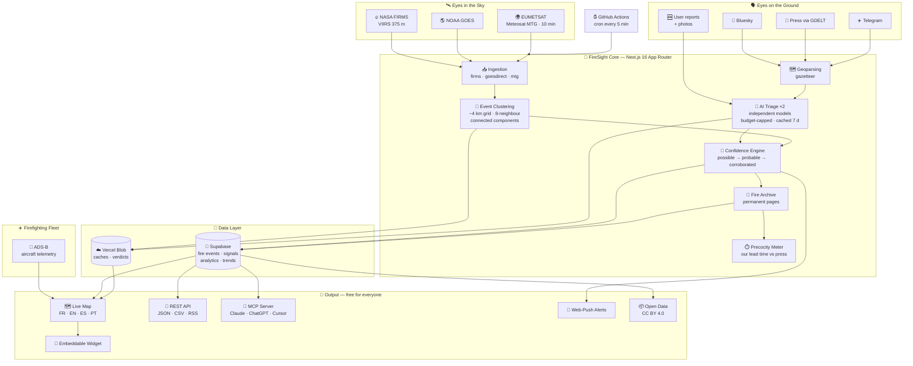
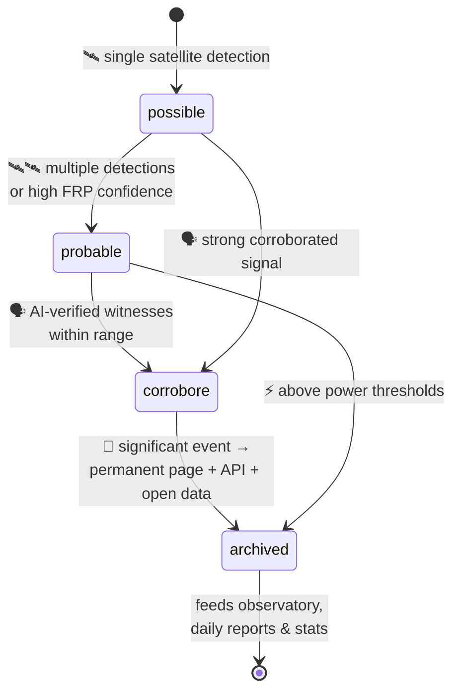

<div align="center">


# 🔥 FireSight

### Every spark in sight. 🛰️👁️

**Early wildfire detection — worldwide, free, and often before the media.**

🌍 *Built for* ***NextStep Hacks 2026*** *— theme:* ***Earth Forward*** 🌱

<br/>

[](https://nextjs.org)
[](https://react.dev)
[](https://www.typescriptlang.org)
[](https://tailwindcss.com)
[](https://maplibre.org)

[](https://supabase.com)
[](https://firms.modaps.eosdis.nasa.gov)
[](https://www.noaa.gov)
[](https://www.eumetsat.int)
[](https://modelcontextprotocol.io)

[](https://github.com/theyapguard/FireSight/actions)
[](https://creativecommons.org/licenses/by/4.0/)
[](#-features)
[](#-contributing)

</div>

---

> 🐤 *The canary once sang in the coal mine. FireSight simply keeps its eyes on the fire — satellites, sensors and verified witnesses — so every ignition is seen the moment it starts.*

> ⚠️ **FireSight is an information service, not an official alert channel.** In an emergency call **112** (Europe), **911** (North America), **193** (Brazil) or your local emergency number.

---

## 📑 Table of Contents

- [🌍 The Problem](#-the-problem)
- [💡 The Solution](#-the-solution)
- [📸 Demo](#-demo)
- [✨ Features](#-features)
- [🏗️ Architecture](#️-architecture)
- [🧠 How It Works](#-how-it-works)
- [🧰 Tech Stack](#-tech-stack)
- [🔌 API, Open Data & MCP](#-api-open-data--mcp)
- [🚀 Getting Started](#-getting-started)
- [📂 Project Structure](#-project-structure)
- [🏆 Why FireSight Wins (Judging Criteria)](#-why-firesight-wins-judging-criteria)
- [🗺️ Roadmap](#️-roadmap)
- [🤝 Contributing](#-contributing)
- [📜 License & Citation](#-license--citation)

---

## 🌍 The Problem

Wildfires are getting **bigger, faster and more frequent** — and the first hours decide everything. Yet today:

| 😱 Reality | 💥 Impact |
| --- | --- |
| 🕐 Official alerts often arrive **hours late** | Families evacuate too late; first responders lose the "golden hour" |
| 📰 People learn about fires **from the media** | News breaks *after* the fire is already out of control |
| 🛰️ Satellite data exists, but is **raw and scattered** | NASA/NOAA/EUMETSAT feeds are hard to read, spread across portals |
| 🗣️ Witness reports drown in **social noise** | A tweet saying "fire near my village" never reaches the right people |
| 💸 Existing dashboards are **paywalled or regional** | Most of the world has no free, global, real-time picture |

**The result:** every wildfire season, communities are surprised by fires that satellites had already seen. 🔥

---

## 💡 The Solution

**FireSight is a free, independent, near real-time world map of wildfire ignitions.** It sees the spark the moment it starts — and tells everyone, in 4 languages, for free.

| 🧩 Piece | ✅ What FireSight does |
| --- | --- |
| 🛰️ **Satellites** | Fuses **NASA FIRMS (VIIRS 375 m)**, **NOAA GOES** and **EUMETSAT Meteosat MTG** (10-minute refresh) into one live feed |
| 🧠 **AI-verified witnesses** | Citizen reports (Bluesky, press via GDELT, Telegram) are geoparsed and **checked twice by independent AI models** before being shown |
| ✈️ **Live aircraft tracking** | Follows water bombers & firefighting planes in real time via **ADS-B** |
| 📖 **Fire memory** | Every significant fire gets a **permanent, citable archive page** |
| 🔔 **Alerts for anyone** | "Alert me on this area" — free **web-push notifications**, no account needed |
| 🌐 **Open by design** | Free REST API, open data (CC BY 4.0), RSS, and an **MCP server** so AI agents can query fires directly |

**One goal:** surface fire starts as early as possible — often **before the media**. ⏱️

---

## 📸 Demo

<div align="center">



*🌍 Live 3D globe — every active ignition on Earth, updated every few minutes. 15 firefighting aircraft airborne. 116 active fires in Russia right now.*

<br/><br/>



*🕐 24-hour window over the Americas — 254 active fires in Brazil, tracked in real time.*

<br/><br/>



*🔎 Zoom into South America — clustered fire events, per-country live counters, one-tap area alerts.*

</div>

---

## ✨ Features

<table>
<tr>
<td width="50%">

### 🗺️ See everything, live
- 🌐 **Interactive 3D globe & flat map** (MapLibre GL)
- ⏱️ Time windows: **6 h / 24 h / 72 h**
- 💨 **Smoke layer** overlay
- 🔍 Search any city or area + 📍 "My location"
- 🟢 Live counters: active fires per country, aircraft airborne

</td>
<td width="50%">

### 🧠 Trust what you see
- 🤖 **Double AI verification** of every witness report
- 🚦 Confidence levels: `possible` → `probable` → `corroborated`
- 🛰️ Multi-satellite cross-check (VIIRS + GOES + MTG)
- 📰 Measured **earliness vs press coverage** (we publish our lead time!)

</td>
</tr>
<tr>
<td width="50%">

### 🔔 Act on it
- 🆘 **Report a fire** with photo upload
- 🔔 **"Alert me on this area"** — free web-push, no account
- ✈️ Live **water-bomber tracking** (per-aircraft pages)
- 🧯 Fire-risk & strategic layers (NIFC perimeters, DFCI)

</td>
<td width="50%">

### 🌍 Built for everyone
- 🗣️ **4 languages**: French, English, Spanish, Portuguese
- 📊 **Observatory**: citable stats per country & month
- 📖 **Fire memory**: permanent page per significant fire
- 🧩 Free **embeddable widget** for any website
- ♿ Pages **degrade gracefully** with zero secrets configured

</td>
</tr>
</table>

---

## 🏗️ Architecture



<details>
<summary>🚦 <b>The confidence state machine</b> — how a spark earns trust (click to expand)</summary>



</details>

---

## 🧠 How It Works

1. **🛰️ Satellites spot the heat.** Hotspots from NASA FIRMS, GOES and Meteosat MTG are clustered into fire events on a ~4 km grid (8-neighbour connected components). The **first detection = proxy for ignition time**.
2. **🗣️ Humans confirm it.** Public witness reports (Bluesky, press via GDELT, Telegram) are geoparsed against a gazetteer, then judged **twice by independent AI models** — is this a fire *happening right now*, and *where exactly*? (Goodbye, "The Globe and Mail" → Globe, Arizona traps. 😉)
3. **🚦 Trust is earned.** Events climb `possible` → `probable` → `corroborated`. Significant events get a **permanent archive page**; aggregates feed the observatory, daily reports and the API.
4. **✈️ Help is tracked.** Firefighting aircraft are identified from ADS-B (registration, ICAO type) and shown live.
5. **⏱️ We measure ourselves.** The *precocity* module compares our first detection against first press coverage — and publishes the lead time.

---

## 🧰 Tech Stack

<div align="center">

| 🎨 Frontend | ⚙️ Backend & Data | 🛰️ Sources & AI | 🚧 DevOps & Quality |
| --- | --- | --- | --- |
| Next.js 16 (App Router) | Supabase (Postgres) | NASA FIRMS · VIIRS 375 m | GitHub Actions CI |
| React 19 | Vercel Blob (caches) | NOAA GOES · EUMETSAT MTG | Cron ingest every 5 min |
| TypeScript 5 (strict) | MCP server (`mcp-handler`) | ADS-B aircraft telemetry | Blocking SEO guard (`seo-guard.mjs`) |
| Tailwind CSS 4 | Web-Push notifications | OpenAI double-triage | Lighthouse perf watch |
| MapLibre GL 5 | Zod-validated APIs | GDELT · Bluesky · Telegram | `tsc --noEmit` + build gate |
| h5wasm (HDF5 in WASM) | fflate compression | Gazetteer geoparsing | Zero-secret CI builds |

</div>

### 📈 By the numbers

<div align="center">

| 📄 TS/TSX files | 🧮 Lines of code | 🛰️ Satellite sources | 🗣️ Witness channels | 🌐 Languages | ⏱️ Refresh | 🔌 API routes | 💰 Price |
| :---: | :---: | :---: | :---: | :---: | :---: | :---: | :---: |
| **124** | **~23 900** | **3 agencies · 5+ instruments** | **3** | **4** | **~10 min** | **15+** | **$0, forever** |

</div>

---

## 🔌 API, Open Data & MCP

Everything is **free — no key, no account.** Attribution required: *"Source: FireSight"* (CC BY 4.0).

| 🎁 What | 📦 Format | 💡 Good for |
| --- | --- | --- |
| **REST API** — live fire clusters & verified witness signals | JSON | Apps, dashboards, research |
| **Open data archive** — every significant fire, continuously updated | CSV | Data science, journalism |
| **RSS feed** — latest significant fires | RSS | Newsrooms, alerts |
| **MCP server** (Model Context Protocol, Streamable HTTP) | MCP | Let Claude, ChatGPT, Cursor or any agent query fires directly |
| **JS client** — [`packages/firesight-fires`](packages/firesight-fires) | npm | Tiny, dependency-free wrapper |

🤖 **MCP tools:** `active_fires` · `fire_archive_search` · `fire_details` · `wildfire_stats` · `firefighting_aircraft` · `earliness_cases` — registry manifest in [`server.json`](server.json).

---

## 🚀 Getting Started

```bash
# 1️⃣ Clone it
git clone https://github.com/theyapguard/FireSight.git
cd FireSight

# 2️⃣ One free key is enough for the live map
#    Get yours: https://firms.modaps.eosdis.nasa.gov/api/map_key/
echo "FIRMS_MAP_KEY=your_key" > .env.local

# 3️⃣ Run it
npm install
npm run dev
```

🎉 Open **http://localhost:3000** — the map is live.

> 💡 Archive, witness signals and aircraft need Supabase + a few provider keys — but **every page degrades gracefully without them**. Our CI builds and runs the full SEO guard with *zero* secrets.

<details>
<summary>🔧 <b>Optional environment variables</b> (click to expand)</summary>

| Variable | 🔓 Unlocks |
| --- | --- |
| `FIRMS_MAP_KEY` | 🛰️ Live satellite map — the only required key |
| `OPENAI_API_KEY` | 🤖 Double AI verification of witness reports |
| `NEXT_PUBLIC_SUPABASE_URL` + `SUPABASE_SERVICE_ROLE_KEY` | 🗄️ Fire archive, witness signals, observatory |
| `BLOB_READ_WRITE_TOKEN` | ☁️ Shared edge caches |
| `CRON_SECRET` | ⏰ Protects the alert cron endpoint |

</details>

---

## 📂 Project Structure

```
FireSight/
├── 🛰️ src/lib/
│   ├── firms.ts · goesdirect.ts · mtg.ts   # satellite ingestion
│   ├── cluster.ts                          # ~4 km event clustering
│   ├── social.ts · triage.ts · press.ts    # witness reports + double AI verification
│   ├── firearchive.ts · observatory.ts     # fire memory + aggregates
│   ├── precocity.ts                        # measured earliness vs press
│   └── aircraft.ts · perimeters.ts · firerisk.ts
├── 🗺️ src/components/FireMap.tsx           # MapLibre GL live map
├── 🌐 src/app/[lang]/…                     # pages in FR · EN · ES · PT
├── 🔌 src/app/api/                         # events · signals · mcp · report · …
├── 📦 src/app/opendata/                    # open-data CSV
├── 🧰 packages/firesight-fires/            # dependency-free JS client
├── 🐘 supabase/                            # SQL schemas
├── ⏰ .github/workflows/                   # CI + cron ingestion
└── 🛡️ scripts/seo-guard.mjs                # structural SEO contracts in CI
```

---

## 🏆 Why FireSight Wins (Judging Criteria)

| 🥇 Criterion | 🔥 How FireSight answers |
| --- | --- |
| **Originality** | Not another dashboard — a *detection pipeline*: multi-satellite fusion + double-AI-verified citizen signals + live firefighting aircraft + a permanent "fire memory". We even publish our **measured lead time over the press**. |
| **Adherence to Track** | 100% **Earth Forward** 🌱: earlier wildfire detection = faster response = saved forests, saved biodiversity, saved CO₂, saved lives. Free & global, so it helps the communities that need it most. |
| **Completion** | Fully working: live map, alerts, archive, observatory, API, open data, MCP server, embeddable widget, 4 languages — with CI enforcing quality on every push. |
| **Learning** | HDF5 satellite products parsed in WASM (`h5wasm`), connected-components clustering, ADS-B decoding, MCP protocol, web-push — a lot of new ground in one project. |
| **Design** | Clean, friendly, mobile-first UI (see [Demo](#-demo)) with a full design system in [`handoff/`](handoff). |
| **Technology** | 3 satellite constellations + 3 social sources + 2 AI judges + ADS-B + push + MCP — many hard pieces, one elegant pipeline. 🤯 |

---

## 🗺️ Roadmap

- [x] 🛰️ Multi-satellite live detection (FIRMS + GOES + MTG)
- [x] 🤖 Double-AI witness verification
- [x] ✈️ Live firefighting aircraft tracking
- [x] 🔔 Free area alerts (web-push)
- [x] 📖 Permanent fire archive + observatory
- [x] 🤖 MCP server for AI agents
- [ ] 📱 Native mobile app (PWA first)
- [ ] 🌫️ Smoke-drift forecasting
- [ ] 🏘️ Community verification network with local organizations
- [ ] 📡 DOI for the open dataset

---

## 🤝 Contributing

Ideas, data sources, bug reports — **all welcome!** 🙌

1. 📥 Clone the repo: `git clone https://github.com/theyapguard/FireSight.git`
2. 🌿 Create a branch: `git checkout -b feat/my-idea`
3. 💾 Commit: `git commit -m "feat: my idea"`
4. 🚀 Open a PR — CI (types + build + SEO guard) must pass ✅

---

## 📜 License

[MIT](LICENSE) — free to use, learn from, and build on.

---

<div align="center">

### 🌱 Earth Forward — because the planet can't wait for the news. 🔥

**Built with ❤️ for NextStep Hacks 2026**

⭐ *If FireSight sparked your interest, star the repo!* ⭐

</div>
